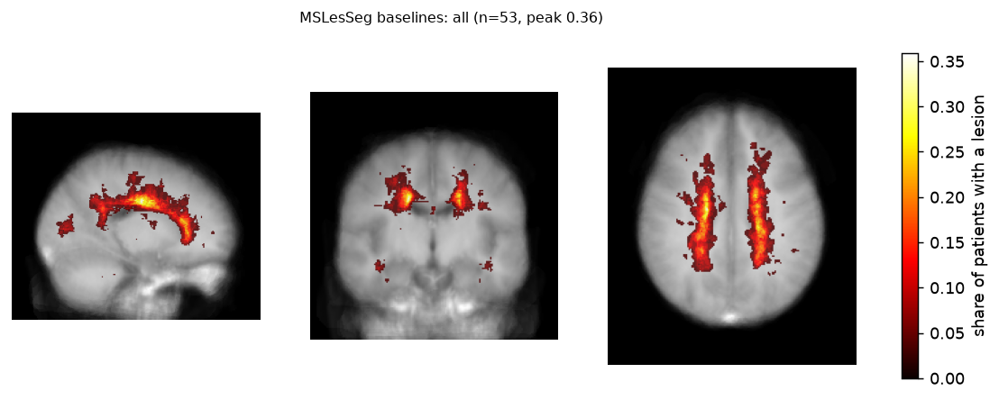

# msdataqc

Checks to run on a longitudinal MS MRI dataset before anyone measures change on it: is the lesion ground truth temporally consistent, is the contrast stable between visits, does the protocol meet the consensus, how much does the counting convention move the counts.

```bash
pip install msdataqc
msdataqc <tool> --help
```

| Tool | Command | What it does |
|---|---|---|
| [`gtdrift`](#gtdrift) | `msdataqc gtdrift` | temporal consistency of longitudinal lesion ground truth |
| [`intensitydrift`](#intensitydrift) | `msdataqc intensitydrift` | contrast drift between visits, behind the tissue gate |
| [`report`](#report) | `msdataqc report` | one QC page for a longitudinal dataset (formerly report) |
| [`magnims`](#magnims) | `msdataqc magnims` | protocol and visit comparability against the 2021 MAGNIMS-CMSC-NAIMS consensus |
| [`lesioncount`](#lesioncount) | `msdataqc lesioncount` | lesion counts under every counting convention |
| [`lesionmap`](#lesionmap) | `msdataqc lesionmap` | cohort lesion probability map and figure |
| [`mslesseg2bids`](#mslesseg2bids) | `msdataqc mslesseg2bids` | MSLesSeg as longitudinal BIDS |

Research software, not a medical device. MIT licence. Each section below keeps the tool's own results and the
corrections that three independent reviews made to them.

## gtdrift


An audit of **longitudinal MS lesion ground truth**. Given the lesion masks of one patient's visits on
one grid, gtdrift finds every lesion site and its presence pattern over time, and flags the patterns
a chronic T2 lesion should not show: **flicker** (present, absent, present), **transient** (absent,
present, absent) and **vanished** (present at the first visit, gone at the last).

```bash
pip install msdataqc
msdataqc gtdrift t0.nii.gz t1.nii.gz t2.nii.gz --sites-out sites.tsv
msdataqc gtdrift --manifest masks.tsv          # subject, time, mask
```

### First result: MSLesSeg (2026-09-29)

The ten MSLesSeg patients with three or four annotated visits, expert masks registered into one
halfway space per patient with [lesiontrack](https://github.com/CedricConday/lesiontrack)
(`results/gtdrift/work/mslesseg_drift.tsv`):

| | All sites | Sites of 50 mm³ or more |
|---|---:|---:|
| Lesion sites | 257 | 176 |
| Flicker (present, absent, present) | 26 | 17 |
| Transient (absent, present, absent) | 51 | 25 |
| Vanished by the last visit | 65 | 34 |

About half of the sites (132 of 257), and 40 % of those of 50 mm³ or more (70 of 176), follow a pattern that is rare for a
chronic lesion. Registration residue can make a small lesion miss a visit; it does not make 17
lesions of 50 mm³ or more disappear and come back at the same place. The likely explanation is that
each visit was annotated on its own. For a segmentation benchmark that is fine. For a longitudinal
benchmark (new, enlarging or resolved lesions) it means the ground truth itself carries change that is
not biology, and every method scored on it inherits that. The audit says how much, per patient.

Caveat stated plainly: T2 lesions can shrink and, rarely, disappear; gtdrift counts patterns, it does
not judge them. Research software. MIT.

## intensitydrift


Longitudinal MS tools assume that a follow-up scan looks like the baseline apart from disease.
msdataqc intensitydrift checks that assumption per visit pair. It measures the scale-free contrast of every visit,
meaning grey matter, CSF and lesions each as a ratio to normal-appearing white matter of the same image.
It then flags pairs whose contrast moved by more than a tolerance (10 % by default). Gain and
normalisation differences cancel; protocol, scanner or processing changes do not.

```bash
pip install msdataqc
msdataqc intensitydrift --manifest visits.tsv --visits-out per_visit.tsv > pairs.tsv   # subject, visit, t1, flair, brainmask[, mask]
```

### MSLesSeg (2026-09-30, corrected)

An earlier version of this README reported a median 26 % change in FLAIR grey/white contrast between visits.
An independent review showed that number was mostly an artefact: the tissue split put extracranial fat and
venous sinus into the "white matter" class, and that class moved between visits. The tool now fits tissue on
the brain eroded by 5 mm and refuses a visit whose split is implausible (white matter 300 to 900 ml, grey matter
400 to 1100 ml).

With that gate, on the 24 longitudinal MSLesSeg patients (63 visits):

* **Only 20 visits have a T1w in which grey and white matter separate.** The rest have almost no grey/white
  contrast and bright venous sinuses, the look of a post-contrast or low-contrast T1w. ANTs Atropos fails on the
  same scans, so this is the data, not the clustering.
* **In 11 of 24 patients one visit passes and another fails.** The T1w character changes between visits of the
  same patient, which is what a longitudinal method would read as change. This is the finding that stands, and
  it matches the annotation instability [gtdrift](https://github.com/CedricConday/msdataqc#gtdrift) finds.
* On the 6 pairs where both visits pass (5 patients), FLAIR grey/white contrast changes by a median 13 %
  (4 of 6 above 10 %), T1w by 8 %. Six pairs are too few to generalise.

Use an external tissue segmentation (manifest column `tissue`: 0 background, 1 CSF, 2 GM, 3 WM) when the
built-in split is refused.

## report

*formerly msqc*

One QC page for a longitudinal MS MRI dataset, to read **before** anyone measures change on it.

* **Contrast drift** between visits ([intensitydrift](https://github.com/CedricConday/msdataqc#intensitydrift)):
  scale-free grey/white, CSF/white and lesion/white ratios.
* **Lesion ground-truth consistency** ([gtdrift](https://github.com/CedricConday/msdataqc#gtdrift)): lesion sites
  that flicker, appear transiently or vanish.
* **Lesion burden** per visit.

```bash
pip install msdataqc
msdataqc report manifest.tsv --out qc.html --title "My cohort"     # subject, visit, t1, flair, brainmask[, mask]
```

The page for MSLesSeg is `results/report/reports/mslesseg.html`. On that dataset only 20 of 63 visits have a T1w in which
grey and white matter separate, in 11 of 24 patients one visit does and another does not, and half of the
annotated lesion sites are not temporally consistent. These are properties of the data, not of any method run on
it. Visits whose tissue split is refused are listed on the page rather than measured. Research software. MIT.

## magnims

*formerly magnims-check*

Does this MS MRI dataset follow the **2021 MAGNIMS-CMSC-NAIMS consensus** (Wattjes et al., Lancet
Neurol 2021)? And are two visits of one patient **comparable** enough to measure change between them?
msdataqc magnims reads a BIDS dataset (NIfTI headers and JSON sidecars) and answers both, per session.

```bash
pip install msdataqc
msdataqc magnims /data/bids --purpose diagnosis      # core sequences, field strength, slice thickness, 3D FLAIR
msdataqc magnims /data/bids --purpose monitoring --json report.json
```

Per session: which core sequences are present (3D FLAIR, T2, post-contrast T1 for diagnosis; 3D FLAIR
for monitoring), field strength at least 1.5 T (3 T preferred), 2D slices at most 3 mm, 3D voxels about
1 mm isotropic, post-contrast delay at least 5 min when recorded. Per pair of visits: field strength,
vendor, model, coil, acquisition type, voxel size and timing within 10 %; any break is printed, since a
change of scanner between visits is the largest source of false "change" a longitudinal tool reports.
The exit code is non-zero when anything core fails, so it can gate a pipeline.

Every rule is in `msdataqc/magnims/rules.py` as the author read it from the paper, to be checked and
changed. On OpenNeuro ds007908 (diagnosis purpose):     - optional: susceptibility-based (SWI/T2*) for the central vein sign or paramagnetic rim: missing (-).

## lesioncount


"Number of T2 lesions" appears in almost every MS paper and trial, and it depends on a convention few of
them state: voxel connectivity (6, 18 or 26), a minimum lesion size, and whether nearby components count as
one confluent lesion. lesioncount counts one mask under every combination and shows the spread.

```bash
pip install msdataqc
msdataqc lesioncount lesions.nii.gz
msdataqc lesioncount --manifest cohort.tsv > counts.tsv          # subject, mask
```

### MSLesSeg baselines (53 expert masks)

| Convention | Total lesions | Against the default |
|---|---:|---:|
| 26-connectivity, no minimum (most software) | 1505 | 1.00 |
| 6-connectivity | 1588 | 1.06 |
| minimum 14 mm³ (a 3 mm sphere) | 1377 | 0.91 |
| minimum 30 mm³ | 1180 | 0.78 |
| components with gaps of 2 mm or less merged | 1274 | 0.85 |
| gaps of 4 mm or less merged | 1061 | 0.70 |
| minimum 14 mm³ and 2 mm merge | 1197 | 0.80 |

For the median patient, the largest and smallest count differ by a factor of 1.5; for one patient, by 4.5.
Two papers reporting "lesion count" on the same scans can differ by 30 % without anyone doing anything wrong.
State the convention, or report volume. (Corrected 2026-09-30: merging is now measured in millimetres; the
earlier version treated 1 and 2 mm identically.)

## lesionmap


The lesion probability map of an MS cohort: at every voxel of a template grid, the share of patients with a
lesion there, as NIfTI plus a three-plane figure, optionally split by a group column (EDSS, course, arm).

```bash
pip install msdataqc
msdataqc lesionmap cohort.tsv --out maps --group edss_group        # subject, mask[, t1, group columns]
```

### MSLesSeg baselines (53 patients, expert masks, MNI space)



The classic periventricular pattern, with a peak of 36 % of patients at one voxel next to the lateral
ventricles. The split by EDSS (17 patients with EDSS 3 or more, 36 below) is in `results/lesionmap/results/` as a picture, not
a finding. A smaller group gives a noisier map, and in 200 random 17/36 splits of the same 53 masks the
17-patient map covered more voxels at the 20 % level almost half the time. Comparing groups of different sizes
needs a permutation test on the map, which is the next feature. Maps and figures are in `results/lesionmap/results/`.

Masks must share one grid; register other datasets to a template first. Research software. MIT.

## mslesseg2bids


MSLesSeg is one of the few public multiple sclerosis MRI datasets with several annotated visits per patient,
and it ships in its own folder layout. mslesseg2bids turns it into longitudinal BIDS: one session per
timepoint, expert lesion and brain masks as a derivative, and age, EDSS and lesion volume in the sessions
tables. BIDS tools such as [magnims](https://github.com/CedricConday/msdataqc#magnims),
[bidsgate](https://github.com/CedricConday/bidsgate) and fMRIPrep-style pipelines then run on it unchanged.

```bash
pip install msdataqc
msdataqc mslesseg2bids "MSLesSeg Dataset" mslesseg-bids
```

Files are hard-linked, not copied. The sidecars say that the images are preprocessed (MNI space,
skull-stripped). Before using the longitudinal ground truth, read what
[gtdrift](https://github.com/CedricConday/msdataqc#gtdrift) and
[intensitydrift](https://github.com/CedricConday/msdataqc#intensitydrift) found in it. Cite the MSLesSeg paper
when you use the data. MIT.
